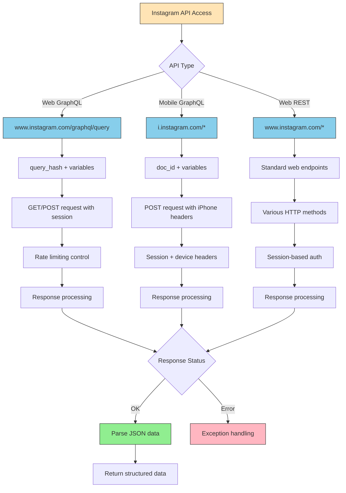

# Instagram API Routes & Request Handling

This document describes how Instaloader communicates with Instagram's various API endpoints and handles different types of requests.

## Overview

Instaloader utilizes three distinct Instagram API types to retrieve data:

1. **Web GraphQL API** - Modern API using query hashes for structured data retrieval
2. **Mobile GraphQL API** - iPhone/iPad-specific API with doc_id-based queries
3. **Web REST API** - Traditional REST endpoints for various Instagram features

Each API type has its own characteristics, rate limits, authentication methods, and use cases. The system implements sophisticated rate limiting, error handling, and retry logic to ensure reliable data retrieval while respecting Instagram's rate limits.

## API Request Flow



## API Types Explained

### 1. Web GraphQL API (`www.instagram.com/graphql/query`)

The primary API for retrieving structured data from Instagram's web platform.

**Key Characteristics:**
- **Endpoint**: `https://www.instagram.com/graphql/query`
- **Method**: GET or POST
- **Authentication**: Session-based with CSRF tokens
- **Query Format**: Uses `query_hash` + JSON-encoded `variables`
- **Rate Limit**: ~200 requests per 11-minute sliding window per query type

**Request Structure:**
```python
params = {
    'query_hash': '<hash_identifier>',
    'variables': '{"user_id":"123","first":50}'
}
```

**Headers:**
- Simulates browser behavior with standard web headers
- Includes CSRF token from session cookies
- Sets `authority`, `scheme`, `accept` headers
- Optional `referer` header for context

**Use Cases:**
- Fetching user profiles and metadata
- Retrieving post lists and media
- Accessing follower/following lists
- Querying hashtag data
- Getting story information

**Implementation Details:**
- Creates a temporary session copy to avoid modifying the main session
- Removes unnecessary headers (`Connection`, `Content-Length`)
- Adds specialized headers for GraphQL requests
- Implements automatic page length adjustment on 400 errors
- Supports cursor-based pagination via `after` parameter

### 2. Mobile GraphQL API (`i.instagram.com/*`)

Instagram's mobile app API, accessed through iPhone/iPad headers.

**Key Characteristics:**
- **Endpoint**: `https://i.instagram.com/api/*`
- **Method**: POST (primarily)
- **Authentication**: Session + device-specific headers
- **Query Format**: Uses `doc_id` instead of `query_hash`
- **Rate Limit**: ~199 requests per 30-minute sliding window

**Request Structure:**
```python
params = {
    'doc_id': '<document_identifier>',
    'variables': '{"user_id":"123"}',
    'server_timestamps': 'true'
}
```

**Special Headers:**
- Mimics iPad Instagram app (Instagram 361.0.0.35.82)
- Includes device-specific identifiers:
  - `x-ig-app-id`: Application identifier (124024574287414)
  - `x-ig-device-id`: Unique device ID from cookies
  - `x-mid`: Machine ID
  - `x-pigeon-session-id`: Session tracking UUID
  - `x-ig-connection-speed`: Simulated connection speed
  - `ig-intended-user-id`: Target user ID
  - `x-pigeon-rawclienttime`: Current timestamp

**Header Mapping:**
Maps cookie values to HTTP headers for authentication:
- `mid` → `x-mid`
- `ds_user_id` → `ig-u-ds-user-id`
- `ig_did` → `x-ig-device-id` and `x-ig-family-device-id`
- `rur` → `ig-u-rur` (with special Unicode decoding)

**Use Cases:**
- Accessing mobile-only features
- Retrieving data not available through web API
- Bypassing certain web API limitations
- Features requiring device-specific authentication

**Implementation Details:**
- Cleans up desktop-specific headers (`Host`, `Origin`, `X-Instagram-AJAX`, `X-Requested-With`, `Referer`)
- Extracts device identifiers from cookies
- Uses longer rate limit windows (30 minutes vs 11 minutes)
- Supports bearer token authentication

### 3. Web REST API (`www.instagram.com/*`)

Traditional REST endpoints for various Instagram features.

**Key Characteristics:**
- **Endpoint**: Various paths under `https://www.instagram.com/`
- **Method**: GET, POST, or other HTTP methods
- **Authentication**: Session-based
- **Rate Limit**: ~75 requests per 11-minute sliding window

**Use Cases:**
- Login and authentication (`/api/v1/web/accounts/login/ajax/`)
- Profile data retrieval
- Story endpoints
- Non-GraphQL features
- Legacy endpoints

**Implementation:**
- Uses standard HTTP session authentication
- Simpler request structure than GraphQL
- May return HTML or JSON depending on endpoint
- Subject to similar rate limiting as GraphQL

## Rate Limiting System

Instaloader implements a sophisticated rate limiting system through the `RateController` class to prevent hitting Instagram's rate limits.

### Rate Limit Windows

Different query types have different rate limit windows:

| Query Type | Window Duration | Max Requests | Requests/Minute |
|------------|----------------|--------------|-----------------|
| GraphQL (query_hash) | 11 minutes | 200 | ~18.2 |
| GraphQL (doc_id) | 11 minutes | 200 | ~18.2 |
| iPhone API | 30 minutes | 199 | ~6.6 |
| Other (REST) | 11 minutes | 75 | ~6.8 |
| All GraphQL Combined | 10 minutes | 275 | ~27.5 |

### Rate Control Mechanism

1. **Query Timestamp Tracking**: Maintains a dictionary of timestamps for each query type
2. **Sliding Window Calculation**: Counts requests within the appropriate time window
3. **Wait Time Calculation**: Determines how long to wait before the next request
4. **Automatic Sleeping**: Waits the calculated time before proceeding
5. **429 Handling**: Special handling for "Too Many Requests" responses

### Rate Limit Algorithm

```python
def query_waittime(query_type, current_time):
    # Calculate wait time based on:
    # 1. Per-type sliding window (11 min for most, 30 min for iPhone)
    # 2. Accumulated GraphQL queries (10 min window)
    # 3. Untracked query adjustments
    # 4. iPhone-specific limits
    
    return max(
        per_type_next_request_time(),
        gql_accumulated_next_request_time(),
        untracked_next_request_time(),
        iphone_next_request()
    ) - current_time
```

### Customizing Rate Limits

You can override the `RateController` class to customize rate limiting behavior:

```python
import instaloader

class CustomRateController(instaloader.RateController):
    def count_per_sliding_window(self, query_type: str) -> int:
        # Customize request limits
        return 150 if query_type == 'other' else 250
    
    def sleep(self, secs: float):
        # Custom sleep behavior
        print(f"Waiting {secs} seconds...")
        super().sleep(secs)

L = instaloader.Instaloader(
    rate_controller=lambda ctx: CustomRateController(ctx)
)
```

## Response Processing

### Successful Response (Status 200)

1. **JSON Parsing**: Response body is parsed as JSON
2. **Status Validation**: Checks for `"status": "ok"` in response
3. **Data Extraction**: Structured data is returned to caller
4. **Header Preservation**: Optional response headers can be captured

### Error Handling

The system handles various HTTP status codes:

| Status Code | Exception | Description |
|-------------|-----------|-------------|
| 400 | `QueryReturnedBadRequestException` | Bad request, invalid parameters |
| 400 (special) | `AbortDownloadException` | Feedback/checkpoint/challenge required |
| 404 | `QueryReturnedNotFoundException` | Resource not found |
| 429 | `TooManyRequestsException` | Rate limit exceeded |
| 401/403 | `LoginRequiredException` | Redirected to login page |
| Other | `ConnectionException` | General connection/request errors |

### Redirect Handling

- Automatically follows redirects within the same host
- Detects login redirects and raises appropriate exceptions
- Logs redirect URLs for debugging purposes
- Prevents infinite redirect loops

### Retry Mechanism

On errors, requests are automatically retried:

1. **Retry Attempts**: Up to `max_connection_attempts` (default: 3)
2. **Error Logging**: Errors are logged to stderr
3. **Rate Limit Handling**: On 429 errors, updates rate controller
4. **User Interruption**: Ctrl+C allows skipping retries
5. **Exponential Backoff**: Automatic wait times increase with 429 responses

### JSON Decode Errors

If Instagram returns invalid JSON:
- Logs detailed error with response status and content
- Retries the request (up to max attempts)
- Eventually raises `ConnectionException` if all retries fail

## Session Management

### Session Headers

Default headers for web requests:
```python
{
    'Accept-Encoding': 'gzip, deflate',
    'Accept-Language': 'en-US,en;q=0.8',
    'Connection': 'keep-alive',
    'Content-Length': '0',
    'Host': 'www.instagram.com',
    'Origin': 'https://www.instagram.com',
    'Referer': 'https://www.instagram.com/',
    'User-Agent': '<browser_user_agent>',
    'X-Instagram-AJAX': '1',
    'X-Requested-With': 'XMLHttpRequest'
}
```

### Session Copying

Temporary session copies are used for GraphQL queries to:
- Avoid modifying the main session object
- Allow concurrent request handling
- Enable request-specific header customization
- Maintain session isolation

### Anonymous vs Authenticated Sessions

- **Anonymous Session**: Used for public data retrieval without login
- **Authenticated Session**: Includes user credentials and tokens
- **Session Switching**: Can temporarily switch to anonymous mode via `anonymous_copy()`

## Best Practices

### For Developers

1. **Use Appropriate API Types**: Choose the right API for your use case
2. **Respect Rate Limits**: Don't override rate controller without good reason
3. **Handle Exceptions**: Properly catch and handle API exceptions
4. **Implement Retries**: Use built-in retry mechanisms
5. **Log Appropriately**: Use context logging methods for debugging
6. **Test with Sleep**: Always enable sleep mode in production

### For Users

1. **Enable Sleep Mode**: Always use `sleep=True` (default) to respect rate limits
2. **Avoid Parallel Instances**: Don't run multiple Instaloader instances on the same account
3. **Monitor Rate Limits**: Watch for 429 errors indicating rate limit issues
4. **Use Session Files**: Save and reuse sessions to reduce login frequency
5. **Be Patient**: Rate limiting is necessary to avoid account restrictions

## Error Messages & Debugging

### Common Errors

- **"Query repeatedly failed"**: Network issues or Instagram API problems
- **"Redirected to login page"**: Session expired or login required
- **"Checkpoint required"**: Instagram requires additional verification
- **"Feedback required"**: Account may be restricted
- **"Too Many Requests"**: Rate limit exceeded, wait and retry

### Debug Information

When rate limit is hit, Instaloader logs request counts:
```
Number of requests within last 10/11/20/22/30/60 minutes grouped by type:
* query_hash_1234567890:    45   50   90   95  120  180
  other:                     15   18   30   32   40   60
  iphone:                     5    6   10   11   15   25
```

The `*` indicates which query type triggered the rate limit.

## Related Documentation

- See [instaloadercontext.rst](../module/instaloadercontext.rst) for detailed API documentation
- See [basic-usage.rst](../basic-usage.rst) for usage examples
- See [troubleshooting.rst](../troubleshooting.rst) for common issues and solutions
- See [login_flow.md](login_flow.md) for authentication details