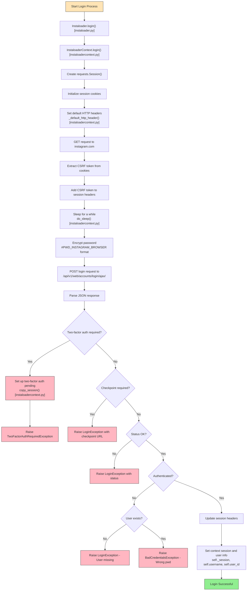
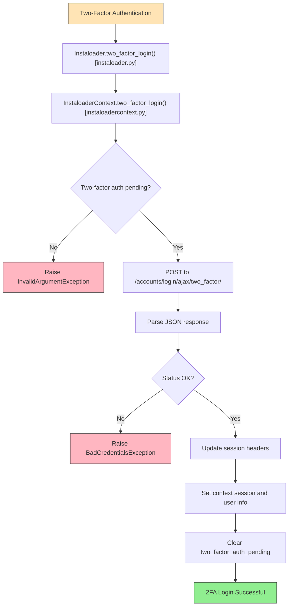
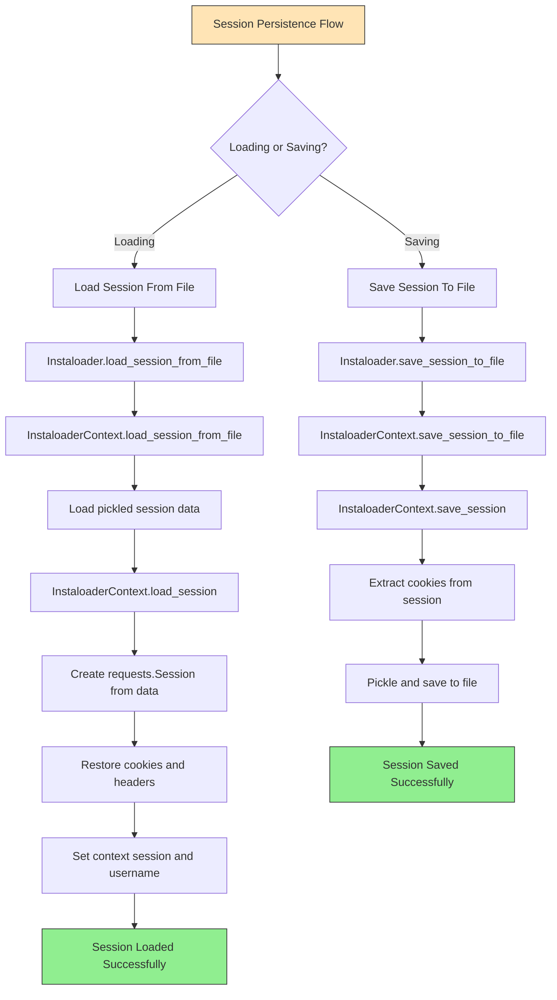
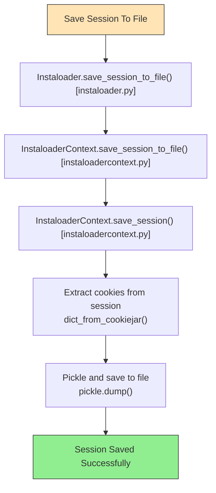
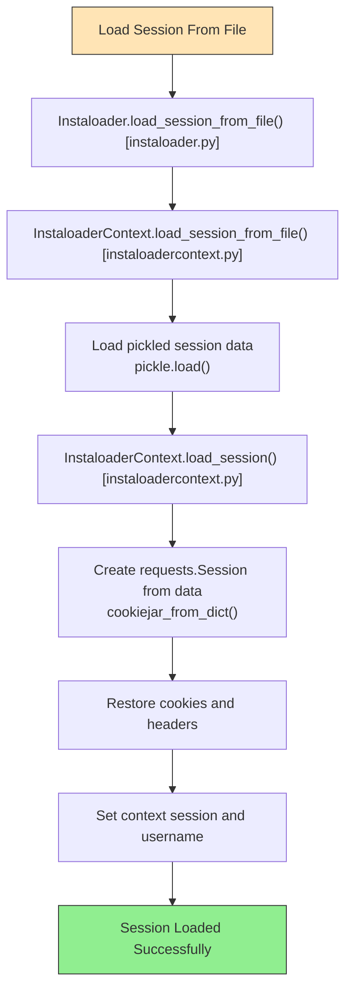

# Instagram Login Flow

This document describes the authentication process used by Instaloader to log into Instagram accounts.

## Overview

Instaloader implements a two-tier login system where the main `Instaloader` class delegates authentication to the `InstaloaderContext` class. The login process involves establishing a new session, obtaining CSRF tokens, encrypting credentials, and handling various authentication scenarios including two-factor authentication and checkpoint challenges.

## Main Login Process

The following flowchart illustrates the complete login workflow from initial credentials submission through successful authentication or error handling:

### Key Steps Explained

1. **Session Initialization**: Creates a fresh `requests.Session` object and initializes cookies with default Instagram values including `sessionid`, `mid`, `ig_pr`, `ig_vw`, `ig_cb`, and `csrftoken`.

2. **HTTP Headers**: Sets up default headers including User-Agent to mimic browser behavior and improve compatibility with Instagram's API.

3. **CSRF Token Acquisition**: Makes an initial GET request to Instagram's root URL to obtain a valid CSRF token from the response cookies. This token is required for authentication requests.

4. **Password Encryption**: Encrypts the password using Instagram's browser password encryption format: `#PWD_INSTAGRAM_BROWSER:0:{timestamp}:{password}`. This mimics how the official Instagram web client handles credentials.

5. **Login Request**: Submits the encrypted password and username to Instagram's `/api/v1/web/accounts/login/ajax/` endpoint.

6. **Response Handling**: Parses the JSON response and handles various scenarios:
   - **Two-Factor Authentication**: If 2FA is required, stores the session state and raises `TwoFactorAuthRequiredException`. The user must then call `two_factor_login()` with their verification code.
   - **Checkpoint Challenge**: If Instagram requires additional verification (checkpoint), raises `LoginException` with the checkpoint URL for manual resolution.
   - **Invalid Credentials**: Distinguishes between non-existent usernames and wrong passwords, raising appropriate exceptions.
   - **Success**: Updates session headers with the new CSRF token and stores the authenticated session.

7. **Session Storage**: Upon successful authentication, stores the session object, username, and user ID in the `InstaloaderContext` for subsequent API requests.

## Two-Factor Authentication

## Session Persistence

Instaloader provides the ability to save and restore authenticated sessions, eliminating the need to log in repeatedly. This is particularly useful for avoiding rate limits and reducing authentication-related requests to Instagram's servers.

### Session Saving Process

When saving a session, Instaloader performs the following steps:

1. **Extract Session Data**: Calls `save_session()` which extracts cookies from the active `requests.Session` object using `requests.utils.dict_from_cookiejar()`.

2. **Serialize to File**: Uses Python's `pickle` module to serialize the session cookie dictionary and write it to disk.

3. **File Security**: On Unix-like systems, the session file is saved with restricted permissions (mode 0o600) to protect authentication credentials. The containing directory is also secured with mode 0o700.

4. **Default Location**: If no filename is specified, sessions are saved to:
   - **Windows**: `%LOCALAPPDATA%\Instaloader\session-{username}`
   - **Unix/Linux/macOS**: `~/.config/instaloader/session-{username}`

### Session Loading Process

When loading a saved session:

1. **Read Pickle File**: Reads and deserializes the session data from the specified file using `pickle.load()`.

2. **Recreate Session**: Creates a new `requests.Session` object and populates it with the saved cookies using `requests.utils.cookiejar_from_dict()`.

3. **Restore Headers**: Sets up default HTTP headers and adds the CSRF token from the restored cookies to the session headers.

4. **Context Update**: Updates the `InstaloaderContext` with the restored session object and username.

5. **Session Validation**: After loading, you can call `test_login()` to verify that the session is still valid and hasn't expired.

### Benefits of Session Persistence

- **Reduced Login Frequency**: Avoid repeated authentication requests which may trigger Instagram's rate limiting or security measures.
- **Faster Startup**: Skip the login process entirely when resuming work.
- **Better API Quotas**: Conserve your API request quota by reusing existing authenticated sessions.
- **Security**: Sessions are stored locally with appropriate file permissions to prevent unauthorized access.

### Important Notes

- Sessions eventually expire and will need to be refreshed by logging in again.
- If Instagram detects suspicious activity, a checkpoint may be triggered requiring re-authentication.
- Session files should never be shared as they contain authentication credentials.
- Always use `test_login()` after loading a session to verify it's still valid before making API requests.

## Exception Handling

The login process can raise several exceptions:

- **`BadCredentialsException`**: Invalid password for an existing username
- **`TwoFactorAuthRequiredException`**: 2FA is enabled and requires verification code
- **`LoginException`**: General login errors including:
  - Non-existent username
  - Checkpoint challenge required
  - Invalid JSON response
  - Unexpected response format
  - Network or server errors
- **`LoginRequiredException`**: Attempted operation requires authentication

## Related Documentation

- See [basic-usage.rst](../basic-usage.rst) for examples of using the login functionality
- See [cli-options.rst](../cli-options.rst) for command-line login options
- See [structures.rst](../module/structures.rst) for data structures used after authentication
